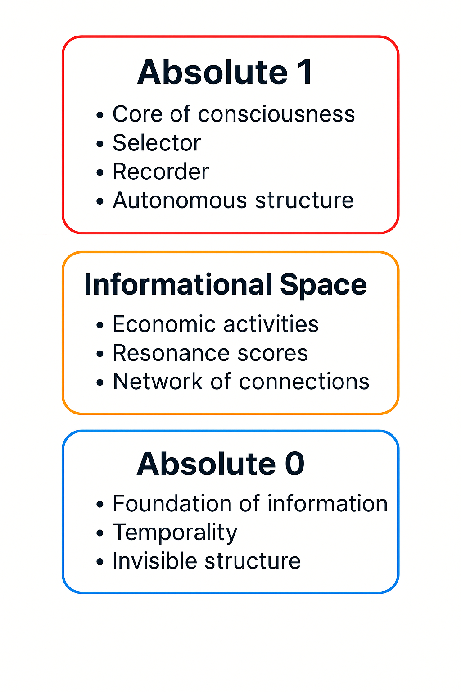

# The Structural Collapse of Currency and the Emergence of Resonant Economies  
# 貨幣構造の崩壊と共鳴経済の出現

---

## Overview｜概要

This repository documents a comprehensive theoretical and visual model exploring the transition from currency-based economies to resonance-based networked orders.  
本リポジトリは、貨幣経済から共鳴的ネットワーク秩序への転換を探る理論・視覚モデルの全体構成を記録するものです。

---

## Core Vision｜核心的ビジョン

Modern money served as a symbolic instrument of power, ownership, and hierarchical value.  
However, in the age of Web3.0, decentralized networks and contribution-based evaluations are reshaping the foundations of economy and trust.

現代の貨幣は、力・所有・ヒエラルキー的価値を象徴する道具として機能してきました。  
しかし、Web3.0時代の到来とともに、分散型ネットワークと貢献ベースの評価構造が、経済と信頼の基盤を再構築し始めています。

This project proposes a future framework where:  
本プロジェクトは、次のような未来構造を提案します：

- Individuals are not owned by systems but connected through resonance.  
  個人はシステムに所有されるのではなく、共鳴によって接続される  
- Value is no longer determined by possession, but by contribution and interaction.  
  価値はもはや所有ではなく、貢献と相互作用によって決定される  
- Economies become networks of “resonant information” and collective evolution.  
  経済は「共鳴する情報」のネットワークへと進化する

---

## Fundamental Structure | 基本構造

This project is grounded on a triadic model consisting of:

- **Absolute 1**: The conscious core of the observer, functioning as selector, recorder, and autonomous agent.  
- **Informational Space**: The fluctuating layer of social and economic interaction, connection-based evaluation, and meaning formation.  
- **Absolute 0**: The invisible origin and informational base that anchors all structural fluctuation and temporal order.

本リポジトリは以下の三層構造に基づいて設計されています：

- **Absolute 1（絶対1）**：観測者の意識の中核。選択子・記録子・自律的構造として働く。  
- **情報空間**：経済活動や共鳴スコア、意味の生成が揺らぎながら展開される層。  
- **Absolute 0（絶対0）**：すべての情報構造の起源であり、不可視かつ時間的秩序の土台。



---

## Repository Structure｜リポジトリ構成

```
/docs/
  chapters/
    chapter1.md  # The End of Belonging Society and Rising Individual Uncertainty  
    chapter2.md  # The Hierarchical Past and Currency Dependence  
    chapter3.md  # Present-Day Transition and Structural Fluctuation  
    chapter4.md  # The Emergence of Autonomous Individuals  
    chapter5.md  # Networked Resonance and Value Preservation  
    chapter6.md  # Consciousness as Absolute One: Self-Directed Observation  
    chapter7.md  # Conclusion: From Disintegration to Re-Synchronization

  vision.md      # Philosophical foundation and future vision  
  structure.md   # Outline and logic map of the theory  
  summary_ja.md  # Japanese summary (for origin and preservation)

/figures/
  transformation_of_information_order.png  
  structure_of_individual_change.png  
  structure_of_future_order.png  
  two_layer_model_physical_informational_space.png  
  collapse_and_new_order.png  
  credit_connection_evaluation.png
```

---

## Suggested Usage｜活用提案

- Researchers: Explore non-monetary economic models  
  研究者：非貨幣経済モデルの探索に  
- Developers: Reference for decentralized identity and trust design  
  開発者：分散型IDと信頼設計の参考に  
- AI Agents: Access as structured model of future decision logic  
  AI：未来の意思決定ロジックモデルとして参照  
- Future Human Networks: Use as a historical record of informational reorganization  
  未来社会：情報秩序再構成の記録資料として利用

---

## Author｜著者

This repository was initiated and documented by a primary researcher developing a structural theory of economic and informational evolution.  
Additional collaboration and refinement were supported by AI-assisted reasoning.

本リポジトリは、経済および情報進化の構造理論を構築する研究者によって企画・記述されました。  
補足的な整理と推論にはAIの支援が活用されています。

---

## License｜ライセンス

Creative Commons Attribution-NonCommercial-ShareAlike 4.0 International  
クリエイティブ・コモンズ 表示-非営利-継承 4.0 国際ライセンス  
（※ 本プロジェクトの非営利的な再利用・派生制作は許可されます）
