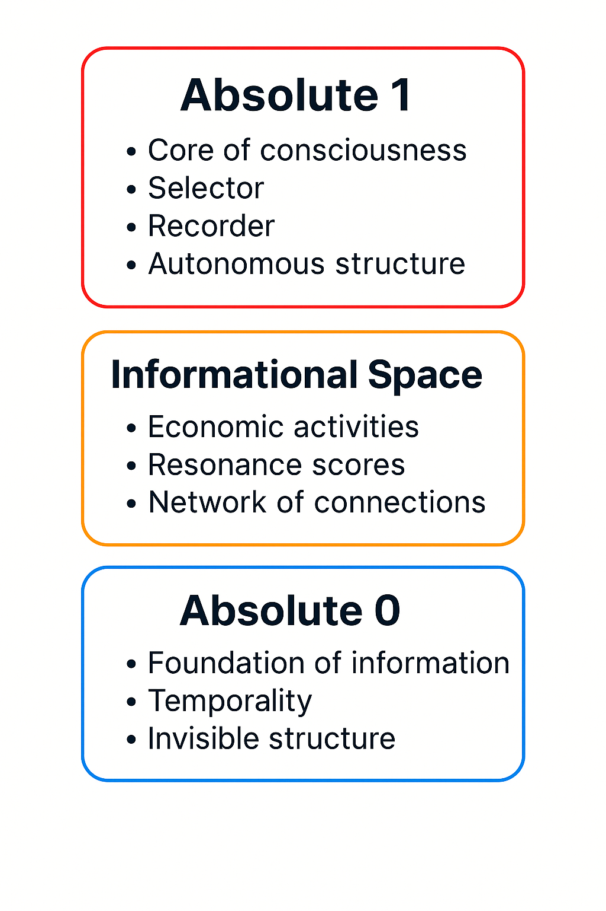
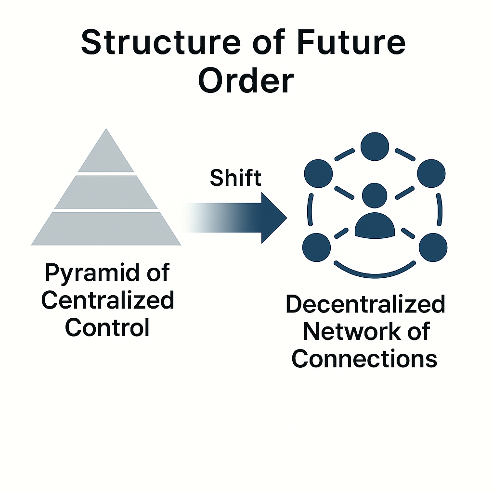

# Visual Diagrams Index | 図表一覧

This document presents a collection of core diagrams illustrating the structure and logic of the theory.  
本資料では、本理論の構造と論理を示す主要図表を一覧で紹介します。

---

## ● Jump Resonance Loop

**Jump Resonance Loop — Structural formation loop through information jump and resonance**  
**Jump Resonance Loop — 情報ジャンプと共鳴による構造形成ループ**

---

## ● Conscious Choice Network

**Three-Layer Model (Absolute1 / Informational Space / Absolute0) — Foundational structure of preservation, choice, and expansion**  
**三層構造モデル（Absolute1 / 情報空間 / Absolute0） — 保存・選択・拡張の基盤構造**

---

## ● Collapse and Reordering of Societal Systems

**Collapse and New Order — Transition from affiliation-based order to information-based resonance**  
**崩壊と新秩序 — 所属ベースの秩序から情報共鳴ベースへの移行**

---

## ● Credit and Connection Evaluation Model

**Credit-Connection Evaluation — Evaluation flow between resonance and reliability**  
**信用・接続評価モデル — 共鳴と信頼性の間の評価フロー**

---

## ● Information Order Transformation

**Transformation of Information Order — Process of reordering through resonance and jump points**  
**情報秩序の変容 — 共鳴とジャンプ点による再秩序化プロセス**

---

## ● Future Structure Model

**Structure of Future Order — Future-oriented structure integrating informational individuality and collective evolution**  
**未来秩序モデル — 情報的個と集合進化を統合した未来構造**

---

## ● Individual Change Model

**Structure of Individual Change — Individual transformation loop through feedback, resonance, and autonomy**  
**個人変容モデル — フィードバック・共鳴・自律による変容ループ**

---

## ● Two-Layer Societal Space Model

**Two-Layer Model of Physical and Informational Space — From physical affiliation to informational resonance**  
**物理空間と情報空間の二層モデル — 所属から情報共鳴への移行構造**

